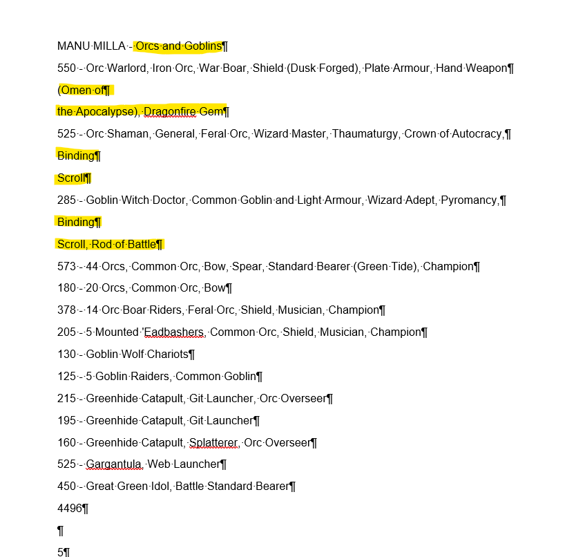
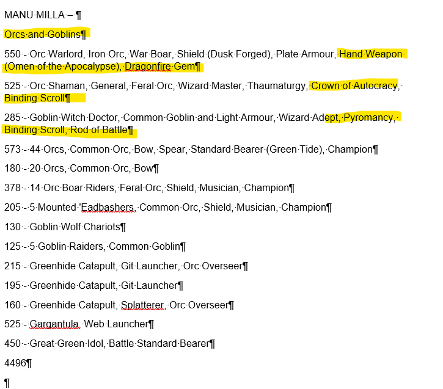

# ninthage-data-analytics
A better way for the project to ingest tournament results


## Requirements for performance metrics from TourneyKeeper

The name of the tournament must exactly match the name of an event on TourneyKeeper.
Additionally the player names in the list document must also match the player names in TourneyKeeper
## Expected file format for ingestion

To be read we require a .docx word document.
The title of the document is the tournament aka "bigbellybash.docx" -> tournament = "bigbellybash"

Then the document itself is a list of legal 9thage army lists in new recruit format but with the following requirements
```
`name` ***Ideally matches TK name***

`army` ***Must be valid 9thAge Army name***

`list` **Currently only newrecruit format is supported***

`total points` ***optional***
```

***Note:*** All lines are trimmed and lines of length 1 or less are removed during parsing as such don't worry if there is lots of whitespace.


eg:
```text
Russell

Vampire Covenant
515 - Vampire Courtier, General (The Dead Arise), Nosferatu Bloodline (Arcane Knowledge), Wizard (Wizard Master, Occultism)
495 - Necromancer, Wizard Master, Alchemy, Necromantic Staff, Binding Scroll
370 - Barrow King, Battle Standard Bearer, Destiny's Call, Paired Weapons (Hero's Heart), Potion of Swiftness
415 - 40 Skeletons, Spear, Standard Bearer (Flaming Standard), Musician, Champion
220 - 20 Skeletons, Standard Bearer (Banner of the Relentless Company), Musician, Champion
214 - 23 Skeletons, Standard Bearer (Legion Standard), Musician, Champion
150 - 21 Zombies, Standard Bearer, Musician
135 - 8 Dire Wolves, Champion
610 - 8 Ghasts, Champion
610 - 8 Ghasts, Champion
465 - Dark Coach
300 - Court of the Damned
4499
```

Also supported is the `20x Skeletons` in addition to `20 Skeletons`

## Common fixes

Often lists look like this:


But easy fixes make it look like this:


## Architecture

